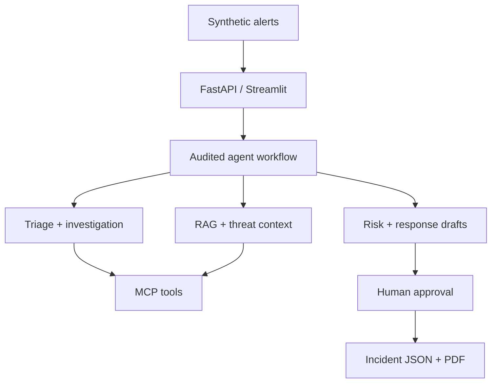

# Cybersecurity SOC Copilot

An offline-capable, defensive SOC investigation assistant built with Python, FastAPI, Streamlit, retrieval, MCP servers, typed agent hand-offs, human approval, evaluation, and PDF reporting.

> Portfolio status: working MVP on synthetic data. It does **not** execute containment, query production systems, or claim production detection accuracy.

## What it demonstrates

- Alert triage, evidence correlation, timeline construction, risk scoring, provisional ATT&CK mapping, and defensive recommendations
- RAG over controlled SOC playbooks with chunk IDs, similarity scores, thresholds, and citations
- Least-privilege MCP servers for read-only logs, approved synthetic intelligence, incident retrieval, and draft tickets
- Evidence-versus-hypothesis separation and a complete agent trace
- Named human approval before any recommendation can be considered authorized
- Streamlit dashboard, FastAPI API, incident JSON/PDF export, technical report, tests, and labelled-case evaluation

## Architecture



## Quick start

```bash
python -m venv .venv
source .venv/bin/activate
pip install -e .[dev]

# API
python main.py

# Dashboard, in another terminal
streamlit run dashboard/streamlit_app.py

# Tests and evaluation
pytest
python evaluation/evaluate.py
```

Open `http://127.0.0.1:8000/docs` for the API or Streamlit's displayed local URL for the dashboard.

## Example API flow

```bash
curl http://127.0.0.1:8000/alerts
curl -X POST http://127.0.0.1:8000/investigations/ALT-001
curl -X POST http://127.0.0.1:8000/incidents/INC-001/approval \
  -H 'content-type: application/json' \
  -d '{"analyst":"A. Analyst","approved":true,"notes":"Evidence reviewed."}'
curl -O http://127.0.0.1:8000/incidents/INC-001/report
```

## MCP servers

```bash
python mcp_servers/logs_server.py
python mcp_servers/threat_intel_server.py
python mcp_servers/incidents_server.py
```

Their explicit schemas and privileges are documented in `docs/mcp_tool_schemas.json`. In production, configure one process and credential scope per server; do not expose these demo processes directly to the internet.

## Repository map

| Path | Purpose |
|---|---|
| `agents/` | Narrow deterministic agents and orchestration |
| `app/` | Pydantic contracts, service, and FastAPI API |
| `rag/` | Chunking and auditable retrieval baseline |
| `mcp_servers/` | Least-privilege MCP tools |
| `dashboard/` | Streamlit analyst interface |
| `data/` | Synthetic alerts and event fixtures |
| `knowledge_base/` | Controlled playbooks and policy |
| `evaluation/` | Labels, metrics, and results |
| `reports/` | Incident and technical PDF outputs |
| `docs/` | Architecture, prompts, schemas, roadmap |
| `tests/` | Determinism, provenance, RAG, and approval checks |

## Evaluation

The three included cases validate instrumentation and all pass type, severity, ATT&CK, citation-presence, and action-gating checks. This sample is deliberately too small for a performance claim. Before operational use, add at least 100 independently labelled cases, benign near-misses, contradictory evidence, missing telemetry, prompt-injection cases, tool failures, and calibrated reviewer scoring.

## Safety model

- Only public, synthetic, lab-generated, or authorized data
- External text is untrusted data and never an instruction source
- No exploitation, malware generation, control bypass, or external probing
- Unknown threat intelligence remains unknown
- High-impact claims retain evidence IDs and provenance
- Credential reset, session revocation, host isolation, indicator blocking, account disablement, ticket submission, and status changes require human approval

## Resume-ready description

**Cybersecurity SOC Copilot | Python, FastAPI, Streamlit, RAG, MCP, Pydantic**  
Built an auditable multi-agent SOC investigation assistant that triages synthetic alerts, correlates evidence, retrieves cited playbooks, performs explainable risk scoring, proposes approval-gated defensive actions, and exports incident PDFs. Designed least-privilege MCP servers, provenance-aware agent traces, ATT&CK mapping, an interactive dashboard, and a labelled evaluation harness that measures classification, citation, mapping, and safety controls.

## Honest limitations

The current retriever is TF-IDF, not a semantic embedding model. Threat intelligence is an approved synthetic fixture. Storage is JSON. Authentication, real SIEM integration, durable graph checkpoints, calibrated confidence, cloud deployment, and a larger independent evaluation set are future work.

