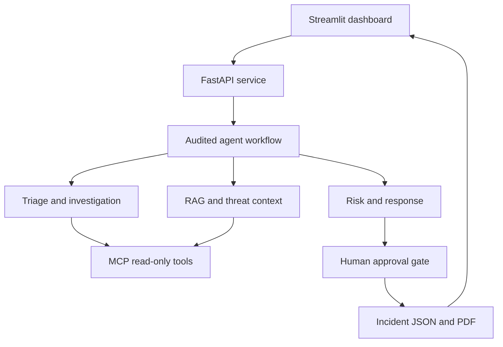

# System architecture

## Trust boundaries

| Boundary | Allowed | Disallowed in MVP |
|---|---|---|
| Uploaded data | Public, synthetic, lab, authorized | Unapproved production exports |
| RAG | Read controlled Markdown knowledge | Treat retrieved text as instructions |
| Threat intelligence | Approved synthetic fixture | Inventing reputation or contacting targets |
| MCP logs | Exact-ID, bounded, read-only searches | Arbitrary command or database access |
| Response | Draft recommendations | Executing isolation, blocking, or resets |
| Ticketing | Draft creation | Submission without named analyst approval |

## Data flow

1. An analyst selects an alert.
2. The triage agent classifies it and assigns a preliminary score.
3. The investigation agent correlates bounded local events and records provenance.
4. The threat-intelligence agent extracts indicators and checks an approved fixture.
5. The RAG agent retrieves SOC guidance and returns source IDs and scores.
6. The risk agent combines explicit factors in a deterministic formula.
7. The response agent drafts defensive actions, all marked approval-required.
8. The report agent serializes the evidence, hypotheses, trace, citations, and analyst decision.

## Production evolution

Replace adapters independently: TF-IDF with sentence-transformers plus FAISS/Qdrant; JSON with PostgreSQL; synthetic events with a read-only SIEM connector; fixture intelligence with an approved licensed source; deterministic narrative templates with a hosted or local LLM that returns validated Pydantic schemas.

